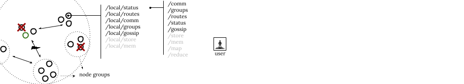

# M3: Node Groups & Gossip Protocols
>Collaboration: Individual milestone\
>Completion: About 8–10 hours\
>Deadline: Monday Feb. 26, 2024 (11:59PM ET)\
>GitHub repo: https://github.com/brown-cs1380/m3


This milestone focuses on abstractions and systems support for addressing a set of nodes as a single system. These abstractions and support comes with additional infrastructure for scalable protocols for assessing the status of nodes in a node group—e.g., for discovering that a node has gone out of sight—and for relaying messaging to node groups in a scalable fashion.

## Table of Contents
- [Background & Context](#background-and-context)
- [Booting up a Node](#booting-up-a-node)
- [Node Groups](#node-groups)
- [Local Services](#local-services)
- [Distributed Services](#distributed-services)
- [Instantiating a Service](#instantiating-a-service)
- [Gossip Protocols](#gossip-protocols)
- [An Gossip Example: Rumor-Counting](#an-gossip-example-rumor-counting)
- [Health Status & Upcalls](#health-status--upcalls)
- [Functionality Checklist](#functionality-checklist)
- [Reflections & The Way Forward](#reflections--the-way-forward)
- [Tips & Submission](#tips--submission)
- [FAQ](#faq)
- [Feedback](#feedback)


<br>

## Background and Context
As discussed in the course, a distributed system is one where a group of computers operates (and is viewed) as a single system. Often, the group of nodes is either static or exhibits a limited dynamic behavior. In this milestone we will implement first-class support for fully dynamic groups of nodes. Node groups combine several goals: 
1) to provide the illusion of a single system out of several nodes, 
2) to allow service customization on a node-group basis, and
3) to adapt the system to multiple scales.

Central concerns in a node group are those of identifying the status and well-being of all nodes in the group and disseminating information across the entire group of nodes. These concerns are particularly interesting *at scale* — when a group is composed of thousands (or hundreds of thousands) of nodes. Developing and using *gossip* or *epidemic* protocols thus becomes crucial for these two concerns, as these protocols allow disseminating non-critical information. The key idea behind these protocols is that a node in a group will communicate with only a random subset of nodes in the group — for example, only *log(n)* nodes in groups of size *n*.

The following online resources might be useful for this milestone:
- JavaScript's global [setTimeout](https://developer.mozilla.org/en-US/docs/Web/API/settimeout) and [setInterval](https://developer.mozilla.org/en-US/docs/Web/API/setInterval) methods
- Node's [process](https://nodejs.org/dist/latest-v20.x/docs/api/process.html) built-in and [child_process](https://nodejs.org/dist/latest-v20.x/docs/api/child_process.html) library
- Ken Birman's [The promise, and limitations, of gossip protocols](https://www.cs.cornell.edu/projects/Quicksilver/public_pdfs/2007PromiseAndLimitations.pdf)

<br>


## Booting up a Node
In the past few milestones, the functionality of our `distribution` library has been extended to provide utility functions, including serialization and deserialization, and a few local services, including communication. As the functionality of the library continues to be extended, services might take longer to set up and configure — therefore delaying a node's bootup time. To know (and perform some action) when a node has completed booting, a new `onStart` property of the node configuration object allows passing a function to be called when the node has finished booting. The `onStart` function takes as (an optional) parameter the HTTP server object, so that when `onStart` is invoked it can manipulate or even stop the HTTP server.

As explained in M2 (see [Per Node Listener and Configuration]()), this configuration should be usable both when importing the `distribution.js` library using `require` and when launching `distribution.js` as a standalone node (a Unix process) via the command line. The former would look like this, expressed in JavaScript:

```js
global.nodeConfig = { "ip": "127.0.0.1",
                    "port": 8080,
                    onStart: (s) => console.log('hi!') }
let distribution = require("distribution.js");
```

The latter would look similar, except it would require passing the node configuration object as a serialized string via command-line parameters and then internally deserializing the appropriate `process.argv` argument. For example, assuming the object above is serialized to the string below assigned to c:[^1]

```bash
c='{"ip": "127.0.0.1", "port": 8080, onStart: "(s) => console.log('hi!')"}'

./distribution.js --config "$c"
```

In both cases, all this node-specific information will be placed on a global object, say nodeConfig, and the function onStart should be arranged to be called after the node completes booting up.

[^1]: The exact string depends on the implementation of the serialize function. If, for example, an extended json or even a yaml format is used as the output of that function, then the configuration parameter would need to be structured appropriately for use by the deserialize function. Therefore, it might be helpful to generate configuration strings using your serialize implementation for your interactive use and deserialization by your own deserialize function.


## Node Groups


A node group, at its core, combines two notions into a single entity addressable by a group ID (GID): 
1) a collection of nodes, and 
2) a collection of services running on these nodes

Similar to how nodes are referenced using node identifiers (NIDs, cf. [M2]()), node groups are referenced using group identifiers (GIDs). But different from NIDs, GIDs are user-provided — and may, or may not, be a hash. 

Two GIDs should be built into the system: 
1. `all`, referring to all nodes in the system, and
2. `local`, referring to the current node

Other node groups are possible — for example, a `browncs` group containing all available nodes in the Brown CS datacenter.

```js
// Get the heap size of the current node
distribution.local.status.get("heapTotal", console.log)

// Get the combined sizes of all nodes in the group
distribution.all.status.get("heapTotal", console.log)
```

The collection of nodes is a set (optionally in an ordered arrangement). These sets are not disjoint between node groups: a node can exist in and be addressable from multiple groups — for example, the `local` node is also in `all`. The mapping of GIDs to nodes is purely a node-local structure, allowing different nodes to see different sets for the same GID, which enables encoding other overlay types beyond cliques. This naming structure allows the same name to refer to a different set of nodes on different nodes — i.e., `browncs` might point to a different set of nodes if called from `n1` vs. if called from `n2`.


<br>


## Local Services
The following table presents a few additions to the `local` set of services. Changes/addition on top of [M2]() are bolded. The differences are explained below.

| Service | Description | Methods |
| --- | ---- | ---|
| [**`status`**](#service-status) | Status and control of the current node | `get`, **`stop`**, **`spawn`** |
| [**`groups`**](#service-groups) | A mapping from group names to nodes | **`get`**, **`put`**, **`add`**, **`rem`**, **`del`** |
| **`gossip`** | The receiving part of the gossip protocol | **`recv`** |
| `routes` | A mapping from names to functions (services) | `get`, `put` |
| `comm` | A message communication interface | `send` |


#### Service `status`
The `status` service is responsible for maintaining node-related information and control.  The implementation of the `get` method is identical to M2 (i.e., it supports `nid`, `sid`, `ip`, `port`, and `counts`) but also adds support for **`heapTotal`**, and **`heapUsed`** (both of which can be obtained via `process.memoryUsage`).

The `stop` method (Usage: `distribution.local.status.stop()`) shuts down the node by stopping the server. It is important for the node to shut down gracefully — i.e., first respond to the request, and then schedule stopping the server (possibly using `setTimeout`).


A new `spawn` method supports launching a new node with appropriate configuration information as explained in the [earlier section about booting nodes](#booting-up-a-node). Spawning a new node should be implemented using the `child_process` standard library for forking (or spawning) and executing a new `distribution.js` process. The `spawn` method takes a callback to be called when the new node completes booting. Internally, `spawn` needs to create that callback using `createRPC`, and then add the RPC to the `onStart` object passed to that node.

```js
let conf = {ip: "127.0.0.1", port: 8082};
let cb = (e, v) => console.log("I'm called in Node 1: Node 2 has booted!");
local.status.spawn(conf, cb);
```

In the example above, `spawn` will create an RPC from `cb`, then extend the `conf` object to include that RPC in its `onStart` field, and then serialize `conf` and pass it as a parameter when launching the child process. If the `conf` object already has an `onStart` function, then spawn could internally create a new function, say `g`, that composes these two functions in a sequential fashion and replace the `onStart` value with `g`.

```js
let cb1 = () => console.log("Do something useful on Node 2!");
let conf1 = {ip: "127.0.0.1", port: 8082, onStart: cb1};
let cb2 = (e, v) => console.log("I'm called in Node 1: Node 2 has booted!");
local.status.spawn(conf1, cb2);
```

In the example above, `spawn` will create an RPC from `cb2`, then create a function `g` that combines the two, and finally spawn a new process passing that argument. `cb1` will be executed on the new spawned node (that’s why we don’t need to create an RPC from `cb1`).

#### Service `groups`

The `groups` service maintains a mapping from node group names to sets of nodes. These sets are maps from SIDs to node objects. It supports methods for retrieving, inserting, and deleting entries. Method `get` retrieves a set of nodes corresponding to a name:

```js
distribution.local.groups.get("all", console.log);
> { 507aa: {ip: "127.0.0.1", port: 8080}
  , 12ab0: {ip: "127.0.0.1", port: 8081}
  , 2f389: {ip: "127.0.0.1", port: 8082} }
```

The `put` method adds to a local names-to-nodes data structure. Note that it does not create a corresponding mapping on other nodes. These nodes can be a subset of the existing nodes — or a new set.

```js
let g = { "507aa": {ip: "127.0.0.1", port: 8080}
        , "12ab0": {ip: "127.0.0.1", port: 8081} };
distribution.local.groups.put("browncs", g, console.log);
```

The `del` method deletes entries from this mapping. Methods `add` and `rem` add and remove a node from a group, defaulting to no-ops (i.e., no effect) when no group or node exists correspondingly.

```js
let n1 = {ip: "127.0.0.1", port: 9090}
distribution.local.groups.add("browncs", n1);
distribution.local.groups.rem("browncs", id.getSID(n1));
```

<br>

## Distributed Services
Distributed services should be accessible from any group including `all` (except for `local`). These services generally apply operations across groups of nodes. Note however, that they do not take as an argument a GID — the mechanics of how this works behind the scenes will become clear in the next section.

The following table contains a set of distributed services. All these services can be implemented as modules stored in a new directory in `/distribution` named `all`.

| Service | Description | Methods |
| --- | ---- | ---|
| [`comm`](#service-comm) | A message communication interface | `send` |
| [`groups`](#service-groups-1) | A mapping from group names to nodes | `get`, `put`, `add`, `rem`, `del` |
| [`routes`](#service-routes) | A mapping from names to functions | `put` |
| [`status`](#service-status-1) | Information about the current group | `get`, `stop`, `spawn` |
| [`gossip`](#service-gossip) | Status and information dissemination | `send`, `at`, `del` |


#### Service `comm`
The `comm` service is the backbone of most distributed services. It sends messages to all nodes in the corresponding group, collecting their responses (values and errors) and passing them to the provided callback.

```js
remote = {service: "status", method: "get"};
// if we were on the same node, this would be status.get("nid"),
distribution.all.comm.send(["nid"], remote, () => {});
```

Internally, method `comm.send` translates to multiple `local.comm.send` calls, with care about concurrency and out-of-order concerns between these calls. To address these concerns, provide an appropriate continuation to each invocation of `local.comm.send`: when called, each continuation stores and counts responses. When the last such continuation is called (identified appropriately by the counter), `comm.send` then calls the provided continuation (in the example above, `() => {}`) providing all the values collected in a node-to-value map. If one or more continuations called by  `local.comm.send` are provided with an error, then `comm` should collect these errors and pass them to a node-to-error map (similar to values) in the appropriate callback argument.

Note that the aggregation is the responsibility of each service, and might be implemented differently depending on the service — for example, some services might add results from all nodes (e.g., to calculate `heapTotal`) while others might aggregate everything in a single set. The client-provided callback is not responsible for aggregation, it simply handles the aggregated end-results.


#### Service `groups`
The distributed `groups` service extends the capabilities of the `local.group` service with the ability to update the group-to-node mappings on all nodes in a group. Methods `get`, `put`, `add`, `rem`, `del` call (or send messages to) the corresponding `groups` methods on each node in a group. Each method calls the underlying `local` call to each node in the group and aggregates the results in an object that includes per-node information. The given callback is called once all nodes in the group have returned their result. Below is an example of calling `distribution.browncs.groups.get`:

```js
distribution.browncs.groups.get('all', (e, v) => console.log(v));
>   { 507aa: { 507aa: {ip: "127.0.0.1", port: 8080}
             , 12ab0: {ip: "127.0.0.1", port: 8081}
             , 2f389: {ip: "127.0.0.1", port: 8082} }
    , 12ab0: { 507aa: {ip: "127.0.0.1", port: 8080}
             , 12ab0: {ip: "127.0.0.1", port: 8081}
             , 2f389: {ip: "127.0.0.1", port: 8082} }
    , …  }
```

Essentially, each node in `browncs` returns its "view" of the all group. It would be perfectly valid to have two nodes inside the same group think the group consists of different nodes altogether. The rest of the distributed groups methods will work in a similar way, returning per-node information.

#### Service `status`
A distributed `status` service combines the information from multiple nodes to create the aggregate value. To complete a `get`, `status` uses the corresponding group `comm` to collect data from all the nodes in the group, performing an addition on the corresponding values — `counts`, `heapTotal`, and `heapUsed`.

The stop method issues a status.stop call to all nodes in the group and then issues a stop to itself. The spawn method starts a new node with appropriate IP and port information, and adds that node to the corresponding group for all nodes (see above).

#### Service `routes`
The distributed routes service provides the `routes.put` method. This is a utility that calls the corresponding `local.routes.put` method on all the nodes belonging in the group. 

<br>

## Instantiating a Service
So far it might seem as if only two static service groups are possible — `local` and `all` — as services themselves do not seem to decide which nodes to interact with. How does `distribution.browncs.status.get` know which nodes to query without *hardcoding* the nodes in the service upon creation? To allow this, services outside `local` should be developed as closures that return functions bound to a function-specific context; we can think of these closures as ***service templates*** and these functions and their context as *service instances for a particular group*.

```js
let status = (config) => {
  let context = {};
  context.gid = config.gid || "all"; // contains a property named gid
  return { get: () => {/** uses context **/}
         , stop: () => { /**uses context**/} };
}
```

This construct allows instantiating services that are configured to point to certain groups — e.g., `browncs` — assuming these groups have been created using the `groups` service. Services can internally query the group service with the appropriate `config.gid` identifier to get the set of nodes in a group. The service template code is written once — but anyone creating a new group using the `groups` service can automatically instantiate it. Consider the following put call that creates a new group:

```js
distribution.all.groups.put("browncs", g, console.log)
```

The `put` call above corresponds to the following steps on each node:

1. Call the corresponding `local.groups.put()`
2. Add a new `browncs` field to the `distribution` object — dynamically this is done by `local.groups.put` passing a `name` (aka `gid`) field to the `distribution` object: `distribution[name] = {}`
3. Then, for each service in the `distribution.all` object, call the corresponding template to construct a new instance. e.g., 
    ```
    distribution.browncs.status = require("./path/to/status.js")({gid: name})
    ```


All methods of a service object have some group-specific context associated with them — As a result of this context creation, methods in the instance correspond only to that set of nodes. Aside from the group of nodes corresponding to a service, this process creates new service instances that hold group-specific service configurations.

You should be able to invoke methods for a certain instance by doing something like:
`global.distribution[context.gid].comm.send(...);`
where `context.gid` could be:
1. the actual name of certain group, e.g. browncs
2. if the following is called inside the template, it could refer to the context variable `context.gid` that is in the scope of the template code 


The group-specific service context allows services to have different behaviors based on characteristics of the group — for example, depending on the group size, different gossip intervals and storage consistency guarantees. We will explore this configurability in the next service: `gossip`.


<br>


## Gossip Protocols
The last service for this milestone (see table above) is a `gossip` protocol service.

#### Service `gossip`
The `gossip` service (and corresponding `local.gossip`) offers interfaces for periodic and on-request dissemination of information across nodes in a lightweight fashion. A key parameter for the gossip protocol is the number of nodes to be contacted — a commonly chosen parameter is a constant number or a function that is sublinear (e.g., logarithmic, `log(n)`) to the number of nodes in the system. The value of this parameter for a particular node group should be chosen during service instantiation, by providing an appropriate function stored in the `subset` field of the context configuration object.

```js
let gossip = (config) => {
  let context = {}; // create service-local context.
  context.gid = config.gid || "all"; 
  context.subset = config.subset || (lst) => 3;
  return { send: () => {}, at: () => {}, del: () => {} };
}
```

Another important property of any gossip protocol is that these nodes (up to the chosen number) should be picked *at random every time* a message is about to be sent to these nodes — either periodically or upon request from other nodes.

Method `gossip.send` is similar to `comm.send`, but instead of sending a message to all the nodes in a group, it sends it only to a subset of nodes in the group (with the size and elements of that subset picked as described above). Other nodes should disseminate this information in a peer-to-peer fashion until convergence has been achieved across the entire node group — i.e., until all nodes are aware of the message. Note, that this is a probabilistic guarantee: nodes will end up receiving the gossip message with an overwhelming probability.


An example of peer nodes exchanging messages through a gossip protocol can be seen in the figure on the left. Each node only communicates with a subset of its peers. Note that Node A may receive the same message three times from three different peers. Scenarios like this one, necessitate handling duplicate messages appropriately; duplicates messages (i.e., a single message received by a node via different gossip paths) must be discarded by the receiver.


Handling cases in which a message is sent to the same node from two or more separate peers requires care. One possible way to avoid this is for each node to keep track of its received messages. Then, it can ignore any message it knows it has seen before. This means that messages need to carry with them extra metadata (such as a logical timestamp) that will differentiate these messages. This logic can live inside the `local.gossip.recv` service.


Method `at` runs another method (passed as a parameter) at periodic intervals measured in ms, and returns a global unique ID that can be called by the corresponding `del` to stop running.

```js
const f = () => { console.log("Running!"); }
gossip.at(5000, createRPC(f), (e, v) => {
  // v = 2134acc705ab…
  gossip.del(v, () => console.log("done!"));
});
```

These methods can be used to implement periodic health checks across an entire node group.

<br>

## An Gossip Example: Rumor-Counting
The example below leverages the gossip service to count all nodes that are aware of a new rumor. The local node asks all other nodes to send, via gossip, a message that invokes a counter service.

```js
// Register a service
let n = 0;
let counterService = { count: () => { console.log(n++); } }
distribution.local.routes.put(counterService, 'counter');

// N.b.: Ask other nodes to send a message that calls our service via gossip
let msg = [ [], {node: nodeConfig, service: 'counter', method: 'count'} ];
let remote = { service: 'comm', method: 'send' };
gossip.send(msg, remote, , console.log);
```
<br>

## Health Status & Upcalls

One periodic check that should be running at the level of the `all` group is one that checks on the status of peer nodes in a group. If a node is found to have failed, the task should (1) remove the node from the group via a `groups.del`, and (2) gradually notify other nodes in the system via `gossip.send`.

This approach allows the group to gradually forget about the missing node; it is the responsibility of that node to request to join the group again. In later milestones we will see more effective techniques for tolerating these kinds of failures.

<br>


## Functionality Checklist
Here's a quick checklist of most of the functionality implemented in this milestone:

1. Allow collecting `heap` information via `status.get`
2. Implement the `local.status.spawn` and `local.status.stop` methods
3. Implement the `local.groups` service
4. Implement `all.comm` 
5. Understand how to start a new group and instantiate its services
6. Implement the `all.status` service
7. Implement the `all.groups` service
8. Implement the `all.routes` service
9. Implement the `all.gossip` service and the `local.gossip` service

<br>

## Reflections & The Way Forward
As part of your submission add a small README.md markdown file with the following structure, along with answers to the following prompts:

```markdown
# M3: Node Groups & Gossip Protocols

> Full name: `<first last>`

> Email:  `<email@brown.edu>`

> Username:  `cslogin`


## Summary

> Summarize your implementation, including key challenges you encountered


My implementation comprises `<number>` new software components, totaling `<number>` added lines of code over the previous implementation. Key challenges included `<1, 2, 3 + how you solved them>`.


## Correctness & Performance Characterization

> Describe how you characterized the correctness and performance of your implementation


*Correctness*: I wrote `<number>` tests; these tests take `<time>` to execute.


*Performance*: Launching a 100 nodes takes about `<time>` seconds, and propagating a message to the entire network via gossip.send at that scale takes about `<time>` seconds — assuming the following protocol configuration: `<e.g., message frequency, subset function, etc.>`.


## Key Feature

> What is the point of having a gossip protocol? Why doesn't a node just send the message to _all_ other nodes in its group?


## Time to Complete

> Roughly, how many hours did this milestone take you to complete?


Hours: `<time>`
```

<br>

## Tips & Submission
Here are some guidelines that might be helpful:

- Make sure you study the provided test cases — their inputs and outputs usually offer significant insights into the expected implementation structure.

- Write additional tests to confirm that your implementation works as expected; try to test the limits of your implementation in your test.

- Read the documentation of packages — standard and third-party ones. (N.b. the only third-party packages allowed are the ones already provided with the implementation.)

- Execute `eslint` frequently, and use the `--fix `flag to correct some of the style errors automatically.

- With complex systems, logging can be an invaluable debugging tool. While developing your system, get into the habit of logging important events  to the console or the file system. Inside your log messages, it’s useful to include the subsystem they originated from. For example: 
    ```
    log(`[MEM] Saved ${configuration} successfully!`)
    ```

To create a submission, run `s/submit.sh` from the root folder of M3. This will create a submission.zip file which you will then upload to Gradescope (select "managed submission" and then upload your zip manually). The zip archive will contain a `javascript/src/main` folder inside which all the files tracked by git and found to be modified. Make sure to `git commit` any new files you have created before running the submit script; the `s/submit.sh` script will not include any untracked files in the submission.


You are allowed to submit as many times as you want up until the deadline; so *submit early and often*. For full grade, before submitting the final version of your code make sure that (1) all linters run without any errors, (2) the provided tests run without any errors, and (3) you have provided an additional five or more tests with your implementation.


## FAQ
Below are some common questions and possible solutions
1. Tests Run Locally but not on the Autograder:
    - In the `status.spawn` method, make sure that the path to the `distribution.js` file is agnostic to where `status.js` is being require'd from. To achieve this, you can use the `__dirname` global variable provided by the Node runtime, which resolves to the absolute folder path of the current file. In your code, you should have something like: `const correctPath = path.join(__dirname, '../../distribution.js');` (Make sure to require the path module).

2. Spawning a new node:
    - How to combine 2 callbacks: Take a look at [new Function()](https://developer.mozilla.org/en-US/docs/Web/JavaScript/Reference/Global_Objects/Function/Function) and [template literals](https://developer.mozilla.org/en-US/docs/Web/JavaScript/Reference/Template_literals) i.e. backtick strings
    - Make sure the original config.onStart and callback are initialized to an empty function if they're undefined.
    

3. Keeping a copy of the server for closing?
    - Considering putting it in `global`

4. Error: callback is not a function 
    - Ensure that the case where no callback function is passed in is handled properly in each function

5. ECONNREFUSED 
    - You can do `ps aux | grep node` to see all the node processes running. You can even send requests to it on the command line via `curl`. The error might be because you haven't waited for the server to "launch" appropriately, via the `onStart` callback


## Feedback
Please let us know if you find any mistakes, inconsistencies, or confusing language in this or any other CS1380 document by emailing cs1380headtas@lists.brown.edu, or filling out the anonymous feedback form. In both cases, concrete ideas on how to improve things would be appreciated.
<br>
